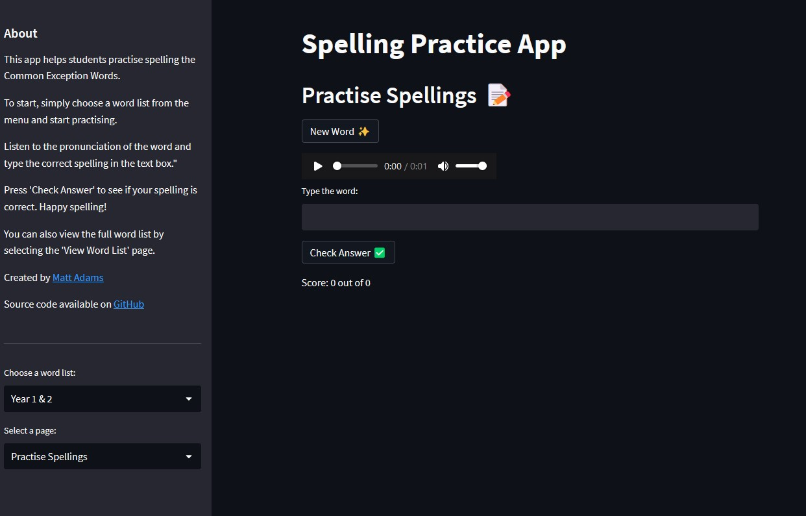

# Spelling Practice App

Welcome to the Spelling Practice App! This interactive web app is designed to help young students practise their spelling skills in a fun and engaging way. Created with Python and Streamlit, it focuses on the Common Exception Words, a list of words that children are expected to know how to spell by the end of each school year.

## Features

- Multiple word lists to choose from, tailored to different year groups.
- Interactive spelling practise session where the app reads a word and the child types in the spelling.
- Instant feedback on each spelling with audio cues for correct and incorrect answers.
- Ability to view the full list of words for each year group.
- Review feature that keeps track of the words spelled incorrectly for further practice.
- Scoring system to track progress.

## How to Use

1. **Choose a Word List:** To start, simply choose a word list from the sidebar menu.

2. **Select a Page:** You have three options: "Practise Spellings", "View Word List" and "View Incorrectly Spelled Words".
   - In "Practise Spellings", click 'New Word' to select a new word to spell. Listen to the word and then try to spell it in the text box. Press 'Check Answer' to see if your spelling is correct.
   - In "View Word List", you can see the full list of words for the selected year group.
   - In "View Incorrectly Spelled Words", you can review the words you've spelled incorrectly during the current session.

3. **Track Progress:** The app keeps score during each practise session and provides a list of incorrectly spelled words for review, encouraging your child to improve their spelling skills.

## Installation

You can run the app straight from your browser! Visit [https://spellings.streamlit.app](https://spellings.streamlit.app) to start practising spellings.

Alternatively, if you'd like to run the app locally:

1. Clone this repository: `git clone https://github.com/mrwadams/Spelling-Practice-App.git`
2. Install the required Python packages: `pip install -r requirements.txt`
3. Run the app: `streamlit run app.py`

## Feedback and Contributions

Your feedback and contributions are welcome! If you have suggestions for improvements or find a bug, please feel free to open an issue or submit a pull request.

Happy spelling!